# Welcome to PP4: Learn English Online! 

For project four I have developed a site for learners of English as a Foreign Language. I am currently working at a university in Germany as an English Teacher, and thought an online resource for my students would be an interesting and fulfilling project to pursue. 

## Project Overview
This website is designed to allow Learners of English as a Foreign Language to create an account, make an online appointment with a tutor to discuss anything about the English language, and also practise some skills with our online games and exercises. This Minimum Viable Product (MVP) version has full 'Create - Read - Update - Delete' (CRUD) functionality as the signed-in user can:
- make an appointment
- change the date, the time, or both the date and time of their appointment
- cancel the appointment altogether.

**CRUD Options**
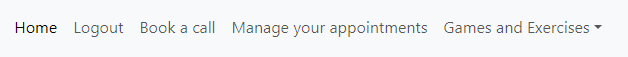

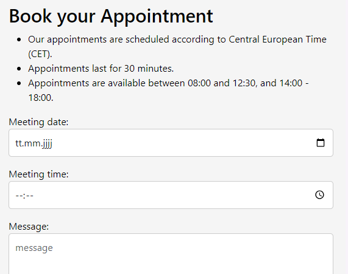

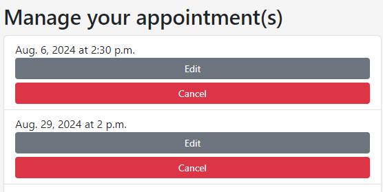

It is built on the mobile-first principle around a Django framework in which I use Bootstrap elements to style the website and enhance the user experience across different browsers and devices. It is supported by a PostgreSQL database issued by the Code Institute. It is secured by a secret key which I generated randomly using https://randomkeygen.com/; the key is set in the env.py which is added to .gitignore, as shown on the 'I think therefore I blog' walk-through project. Additionally, the front-end and back-end security is provided by the @login_required decorator along with CSRF protection implemented via the  template tag. It also has a basic admin interface in which the superuser can do the following: 
- view all users and appointments
- add language exercises
- update or delete users, appointments and exercises as required.  

**Why focus on appointments?**
I decided to implement the CRUD functionality around the appointment function to put some distance between my project and the 'I think therefore I blog' walk-through project; I was concerned I would end up copying too much of that project as I am obviously not capable of improving on it! However, a forum for users to discuss problems with the English language would be a good idea, and there exists an 'English Language and Usage' [Stack Exchange](https://english.stackexchange.com/) (based on the more famous coding Stack Exchange); in a future interation, this would be an interesting feature to implement. 

## Key Technology
- Django Web Framework
- Python
- Bootstrap front-end framework
- HTML
- CSS
- Javascript
- PostgreSQL supported by the CodeInstitute (https://dbs.ci-dbs.net/)

 
## Structure
The most important apps and folders which I customised to my project are: 
- english_tutor: the project app
- appointments: for booking and managing calls between the users and the tutors
- games_and_exercises: stores the online exercises
- home: the homepage
- static and staticfiles: CSS, favicon, images, JS
- templates: base.html, 404.html, login.html, logout.html, signup.html
- user_accounts: stores user information at registration

## User Demographic
This game is aimed at learners of English as a foreign language of all ages. The exercises are set between the A2 and C1 levels; these levels are correspond to levels of language proficiency as defined by the Common European Framework of Reference for Languages (the CEFR). Broadly speaking, levels A - C equate to the following:  
- A: basic users
- B: intermediate users
- C: proficient users 

Each of these levels is divided into two subgroups to reflect progress in language learning. For the purposes of this project, I have provided exercises for the following groups: 
- A2
- B1
- B2
- C1

as these are the groups I am most familiar with. A future iteration could easily cover A1 and C2 students.

My students come from around the globe; about half are German and the rest are from across Europe, the Middle East, across Africa, Asia and South America. It is often the case that language learners from a particular groups struggle with different aspects of the English language; German speakers find the difference between the past simple and present perfect difficult, for example, whereas Russian and Arabic speakers need extra practice with the definite and indefinite articles ('the' vs 'a / an' ). Learners of all languages find phrasal verbs and linking words challenging. So after teaching at this college for nearly five years, I have developed a decent grasp of what learners from each language group and level need. The exercises I have designed for this MVP are just the first step, and further iterations will both deepen and expand the offer to reflect this. 

More information about the CEFR can be found here: https://www.coe.int/en/web/common-european-framework-reference-languages/home

# UX and Design
Following the mobile-first approach of the Code Institute, as well as the educational purpose of the website itself, I have tried to keep the design and layout of this project as simple as possible. 

## Design
Some basic research showed me that educational or language learning-related websites utilise a mix of whites and blues / greens, e.g. [Grammarly](https://www.grammarly.com/), [the DeepL Translator](https://www.deepl.com/en/translator), and [DuoLingo](https://www.duolingo.com/learn). Related websites like [ChatGPT](https://chatgpt.com/) and [Google Translate](https://translate.google.com/?sl=de&tl=en&op=translate) follow a similar aesthetic, and this [Verpex Blog](https://verpex.com/blog/website-tips/best-color-combinations-for-educational-websites#) was very informative on the subject.

I therefore settled on a fairly muted mix of whites and blues to minimise distraction from the educational content, and to strike a professional tone with my audience. Duolingo is notably different in that it utilises a range of symbols and stickers to liven up progress, but in order to get my MVP ready for submission by the set deadline, I decided against adapting this much more challenging approach as it would require not only significantly better coding skills, but I suspect extensive market research and analysis of on-site user behaviour!  

**Brand Image**
The base colours are as follows:
- The header image: is a picture of the sky. I originally planned to use a colour like Viennese Blue (#407aac) but found this picture of the sky and decided the colour gradient provided a bit more visual interest; additionally, I found there to be a nice link between travel and language learning which is inspired by the sky.  
- The background colour of the website body is white (RGB 255, 255, 255).
- The background colour for containers is white-smoke (RGB 245, 245, 245). 

*Viennese Blue:*
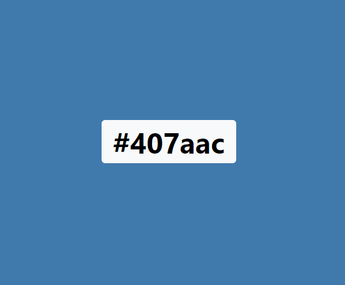

Taken from: https://icolorpalette.com/color/407aac

*The image I used for the header:*

## Text vs Images 
This website has fewer images than might be expected of a modern website. This is however deliberate. As the focus is on language practice, it is difficult to translate this into engaging images as is possible for, e.g. a food or travel site. There are some images, but I have kept them to a minimum to avoid distraction, and I was concerned that superfluous images would detract from my goal to keep the design as lean as possible.   

# Site overview

I have tried to build upon functionalities that we covered in Project 1, such as responsive design, using a hamburger menu for the mobile navbar, and so on. What follows are features that I have not coverd before. 

Note: all key functionalities are easily accessible from the navbar and / or pop-up modals.  

## Django DRY Templates 
The header, navbar and footer are all stored in templates/base.html and all other templates are designed to allow this template inheritance; this is one feature of Django I particularly appreciate as it conforms to the 'Do Not Repeat Yourself' (DRY) principle. My base.html is therefore visible on all pages, including the custom 404 and 500 pages.  

## Homepage: cards and accordions  
I chose to add some explainers to the homepage for several reasons.  
- The card explainers: these cards appear at the top of the page and are small enough to give the visitor an 'at-a-glance' survey of the purpose of the website and what we offer. I chose Bootstrap Cards because the headers are concise, can be expanded to give more information, and work well on mobile. 
- The accordion explainers - why this feature? It is similar to the cards in that it can convey precise information in an extremely concise way, doesn't take up too much room - so is excellent for mobile - and can expand for more information when necessary. 
- The accordion explainers - why even give this information? English is very widely spoken, often to a decent standard, and during my teaching career I have often heard the question "Why must I bother with English, I can do it anyway!" My answer in those cases is to tie the language skills to particular purposes: yes, your English is good, but would you be comfortable leading a team or writing an essay or dissertation in English? What about doing a degree program in English, not just in an English-speaking country, but even in a coutry like Japan? And for everyone with a second or third language, there are always gaps to fill or things to improve. I have included this information to appeal not just to that sense of ambition to get better, but also to provide practical use-cases where better English skills will be a definite, practical benefit.    

I view the relationship between the two sections on the homepage like the front page of a newspaper: the cards are the top-fold of the website - what people see first - and the accordion elements are the bottom-fold, providing more information for those who are interested.  

## Homepage: modals
As the CRUD functionality can only be accessed by registered and signed in users, I have added Modals to the two of the cards on the homepage to encourage users to either register or sign-up at relevant calls-to-action. Again, these are excellent for mobile devices.  

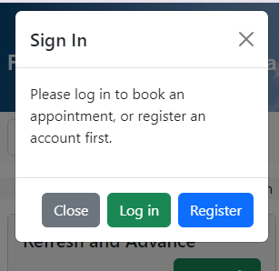

## Registration page
You can register with this site with an absolute minimum of information. The benefits of this approach are:
- it is easy for the user, which means it will convert a greater percentage of 'hit-and-run' visitors into actual site users
- in a post-mvp world, I will enable a 'user account' section where users can add personal details, such as names, if they wish 
- security: the less information a website holds the better. Hacking and / data leaks (intentional or not) are an ever-present risk, so I prefer websites which ask for less personal and sensitive information over those which request more than the bare minimum.  
- I implemented the 'view password' functionality here because it is a feature that I personally like, particularly at registration where typos can slow things down, so I was happy to implement it here.  

*Catching a typo with toggle password:*
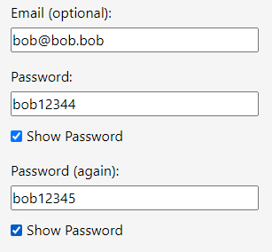

**Next steps:**
- Implement email confirmation link

## Sign In and Sign Out
- The Sign In page carries a link to registration in case the user is not registered
- The Sign Out function is a two-step process: first navbar link then an 'are you sure?' page to confirm the action.

**Next steps:**
- Implement function to change password via email link

## Make an appointment
- The user must be signed in
- They choose first the date, then time and can add an optional message 
- So long as the appointment is successfully made, the user is guided to a confirmation page
- Validation messages: see the section on the Appointments Model for a run-through of the form validators

**Next steps:**  
- Add a booking code on-screen 
- Send it via email to confirm 
- Remove the need for the user to add the year 
- Display only 5 minute intervals on the time selector to avoid messy meeting times and schedules

## Manage appointments 
- This link brings up all appointments which the user can edit or cancel as they wish.
- The edit booking function allows the user to choose: 
    - a new date
    - a new time
    - a new date and time 

This draws on the same model as the 'make an appointment' function; it therefore has the same form validation.

- Cancelling the appointment triggers another Modal to confirm with the user that this is what they really want to do.  

Both actions lead to confirmation screens.  
  
**Next steps:**
- Filter the display of appointments by date (choose between ascending and descending)
- Incorporate the appointments into a user account section 
- Allow the users to view their own appointment history 

## Games and Exercises 
- The different sub-navbar points lead to excercises for the different language levels 
- Multiple secions can be made for each language level 
- People doing the exercises get right / wrong feedback when they submit their answers

**Next steps:**
- Expand the offering beyond multiple choice to include free-text fields and other different types of exercises
- Allow a 'hint' function for some exercises
- Keep a history of the user's progress in their 'user account'
- More exercises!  
- Admin section: improve this section so you can filter by language level, and see all relevant exercises for C1 learners, B2 learners, and so on.  

# Database overview

My database is supported by a PostgreSQL database issued by the Code Institute.

## User Information Model
This is captured at the user-registration page and stored in the user_accounts app/model.py.
In the future, this will be the basis for the user account section, where the User will be the ForeignKey around which other information will be arranged. 

At present, it allows for the capture of a username, email and password on-screen when the user registers. For the purposes of this MVP, the name and surname fields are present in the model, but I have not yet provided a field for the user to enter them. In the future, this will happen in the 'user account' section which is not yet implemented.  

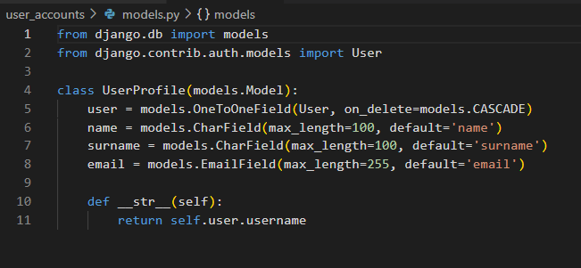

**Next Steps**
- Implement a user account for signed-in users
- Define 'user_profile' as the FK for this section
- Allow users to change and update names (but not 'username'), email, password
- Allow users to view appointments and progress with exercises 

## Appointments Model
This is stored in the appointments app/models.py. The user_profile captured at registration is the ForeignKey as the core of a one-to-many relationship. At the point the user makes an appointment, the user is already signed-in so the information provided by the user_profile FK is present; by booking an appointment, the model captures meeting date and time, an option message provided by the user, and a hidden created_on = models.DateTimeField field; this is all then linked to the user_profile.

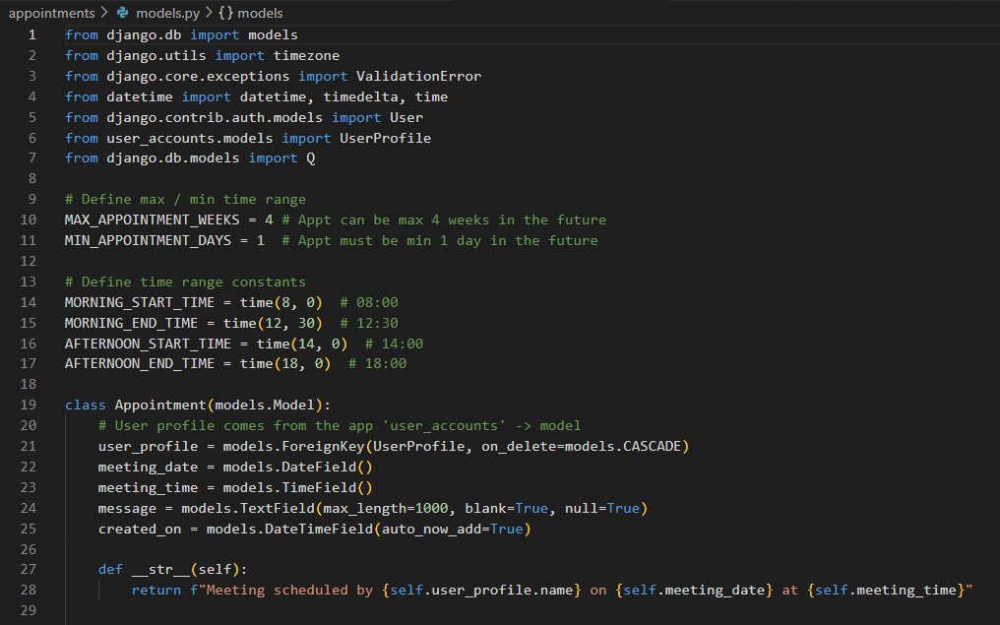

**Diagram of the relationship**

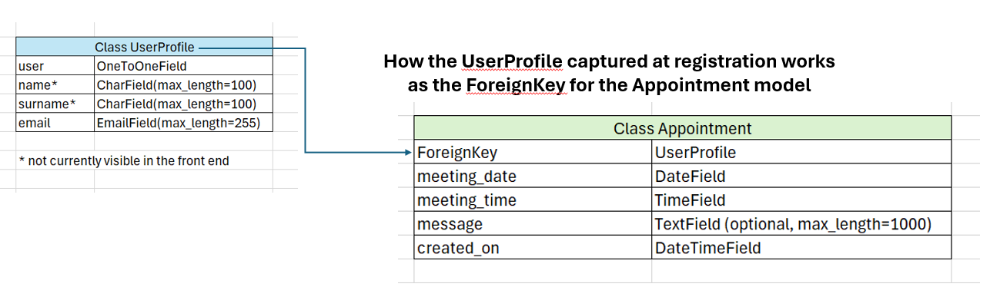

**Explanation of the relationship.**
The UserProfile captured at registration provides the ForeignKey for the Appointment model; it links the meeting date, time and any message to the user currently signed-in to the website.  

It also allows the ‘manage appointment’ feature to function, populating the field with any appointments already made (by clicking on 'manage appointments), and linking any changes to the appointment (time, date, cancellation) to that signed-in user.  

**Form Validation and Constraints.** I have added the following validations and constraints on the appointments model by implementing the Django 'clean' method.  

Note: this is set up with the idea that just one tutor is available. 

Variables explanation: 
- min_date: this is designed to ensure that appointments can only be made in the future, to avoid unintentional / intentional appointments in the past.
- max_date: in order to keep the overview of the appointments, users can only book up to 4 weeks in advance. This variable is easily changed.
- meeting_duration: appointments are advertised as 30 minutes, but I have set up a 40 minute block in the back-end to give the tutor a buffer between meetings. This variable also helps avoid meeting overlap (see below) and can be easily changed.  
- meeting_start and meeting_end: based on the meeting_duration, this tracks what block of time should be marked as 'unavailable' for when other users attempt to make appointments.
- overlapping_appointments: this draws on the meeting start/end so when a user books an appointment, this is run in order to identify if another meeting is in place during this booking request. 

Error messages: 
In each of the above cases, error messages are shown to the user to alert them to the problem:
- Please check your appointment date: your appointment must be between {min_date} and {max_date}
- Please choose a different time. Our appointments run between {MORNING_START_TIME.strftime('%H:%M')} and {MORNING_END_TIME.strftime('%H:%M')}
- "This appointment slot is unavailable. Please choose a different time."

**Next steps**
- Allow for extra tutors to be added to the schedule 
- Implement a trigger for email confirmation for any bookings / changes / cancellations.
- Implement a filter so users can list their appointments sequentially by date 

# Planning and Agile Methodologies

I followed the Agile methodology as outlined in the "I think therefore I blog" walk-though according to MoSCoW prioritization. I have completed 17 user stories, with the rest divided between 'saved for later' (i.e. the post-MVP version) and 'did not finish'.  

Here is the link to my Kanban board: https://github.com/users/rich-p-rich/projects/3/views/1  

The nummeration of the user stories: I did not add the user stories to the Kanban board in order of priority, but according to theme as I was drawing the project up. In retrospect, I think it would have been better to add the initial user stories according to their priority as it would likely make the workflow easier for others to follow, and I will probably follow this principle in the future.  

Note: the # of each story corresponds to their Number on the Kanban board.  

**Must have: all implemented** 

- #1: User story: view the homepage
- #3: User story: account registration
- #4: User story: schedule a first contact call with a tutor
- #5: User Story: change the time of an existing tutor call
- #6: User story: cancel a call with a tutor
- #9: User story: make an appointment
- #12: User story: enable log-in and sign-out functionality
- #13: Website owner story: restrict content to signed-in users
- #15: User Story: view all appointments
- #16: Website owner story: add modal to user_account app

**Should have: all implemented**
- #7: Uer story: choose between exercises
- #10: Website owner story: retrictions on appointment time and date
- #11: Website owner story: ensure appointment clashes are not possible
- #17: User story: recognise error messages more easily.
- #19: User story: custom 404 page
- #23: User story: feedback on answers in exercises

**Could have: implementation status varies**
- #14: User story: toggle password at registration: implemented
- #2: User story: see sample content: not implemented
- #8: User story: participate in forum: not implemented
- #24: User story: custom 500 page: partially implemented

In addition to the CodeInstitute's overview of the Agile methodology, I found the following Atlassian resource very helpful: 
https://community.atlassian.com/t5/App-Central/Understanding-the-MoSCoW-prioritization-How-to-implement-it-into/ba-p/2463999

# Challenges, changes and bugs 

## The development of the appointments app
My plans regarding the 'make an appointment' functionality changed significantly during the course of development. 

Originally, I wanted anyone - including unregistered users - to be able to book an appointment without setting up an account as I thought this would help covert a higher number of visitors to customers, and this is how I implemented it. In order to implement the rest of the CRUD functionality, the 'manage appointments' section was called 'search and edit appointments' so that the user could search for their appointments via email and surname. I took the idea from airlines that allow you to view your flight via surname and booking number without actually logging into the account.

In practice this worked fine, but it was an insecure approach as it was then possible for anyone with the email and surname combination to search and change appointments, which was obviously undesirable. 

I therefore changed the approach and required anyone who wants to make / change / cancel and appointment to have registered an account and be signed in: this is why I added a model to the user_account app, as this stores the user_profle, and it is a much more secure approach. 

My take-aways from that change in approach were (i) I learned how to implement that search functionality and, more importantly, (ii) pay more attention to the big picture during the early development phase.  

## Changes to the Games and Exercises App

I went through several different iterations of the Games and Exercises App. An initial version was implemented a drop-down menu, but as I added more exercises it became more unwieldy and hard to manage.

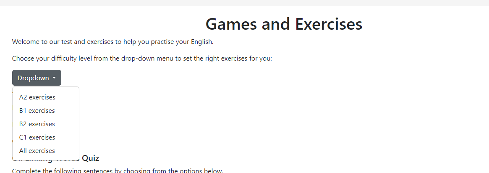

I then switched to the admin section where the superuser can add a section and link the questions to the section.

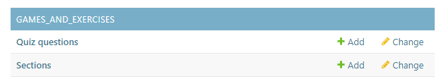

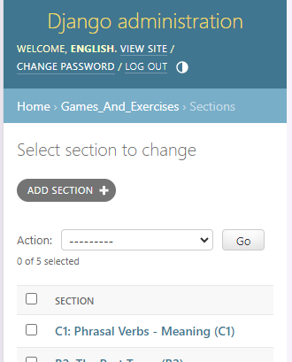

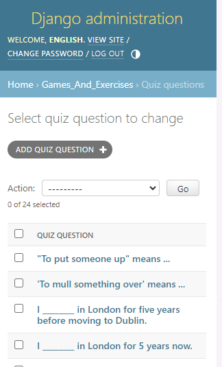

**Next Steps**
- I have not optimised the 'all exercises' link. It currently leads to a blank page and I could not find a reliable way to add the sections to this page: https://8000-richprich-englishtutord-94zz8l90n00.ws.codeinstitute-ide.net/exercises/sections/All/  

In order to get the MVP ready, however, I decided this was more of a 'Could' than 'Should' have task, so have not taken the time to work on it. However, for a post-MVP website, this is a 'Should have' task. 

Although it is possible to link questions to sections, it needs a better admin panel where you can:
- filter first by language level -> then see all sections
This would be the next step for the admin section and would enhance the scalability of the site. 
- I also need a better solution for the 

## Other bugs and challenges
In addition to the challenges described above, I encountered many bugs and challenges during the development of this app. In particular, the Games and Exercises was difficult to get right. I found it a challenge to work out the logic to correctly display the correct / incorrect answers when the user submitted their solutions. The calculation on the backend was correct, but the display was wrong. This took some time to solve.  

# Deployment

Here follows an overview of the steps I took to deploy the project.

## GitHub and GitPod
- Find and use the CodeInstitute's 'Gitpod' template: https://github.com/Code-Institute-Org/ci-full-template
- Use this template -> create new repository
- Ensure visibility is set to public
- Create repository 
- Open in GitPod
- Run initial commit to ensure the GitPod repository is correctly linked to GitHub

## GitHub User Stories
- I chose to create my user stories on GitHub
- In your project: click 'Board template' -> name it 
- Go to the ellipses in the top-right and  choose 'Workflows' 
- Click 'item added to project' -> edit -> deslect 'pull request'
- Define as 'Status: ToDo' 
- Save
- Turn on workflow 
- Create your user stories  

## Django
- Install Django with the pip3 install command
- Create a new app
- Update settings.py Installed_Apps with the app name
- Import HttpReponse in views.py
- Import the app into urls.py
- Run the server at port 8000
- Copy the hostname between square brackets and add it to the 'Allowed_Hosts' section of settings.py
- Add requirements.txt file with pip3 freeze local > requirements.txt
- Create the project with django-admin startproject <project name>
- Create the env.py file, add to .gitignore, commit changes to check that env.py has been ignored
- If successful, create a secret key and add to env.py

## Database
Sign-up to a database provider and get your database link
- I chose to go with the CodeInstitute for this project: https://dbs.ci-dbs.net/
- Add the database URL to env.py

## Heroku
- First in your GitPod repo, install gunicorn and add to requirements
- Then add the Procfile
- Set DEBUG to False 
- add '.herokuapp.com' to allowed_hosts in your settings file 
- Create a new app on by going to the Heroku homepage -> 'new' -> 'create new app'.
- Name it accordingly: I chose to give it the same name as my GitPod repository for clarity  
- Go to Config Vars: add the secret key, port 8000  and database_url
- Deploy app  

## Other technologies used
- Am I responsive for the device image at the top of the ReadMe: [Am I Responsive? (ui.dev](https://ui.dev/amiresponsive)
- Google Fonts: https://fonts.google.com/: Roboto and Libre Franklin
- For generating the Favicon: https://favicon.io/
- To generate a random secret key: https://randomkeygen.com/
- Pexels for images: https://www.pexels.com/
- I HEART IMG for resizing images: https://www.iloveimg.com/resize-image
- CloudConvert for converting images to webp files: https://cloudconvert.com/jpg-to-webp

