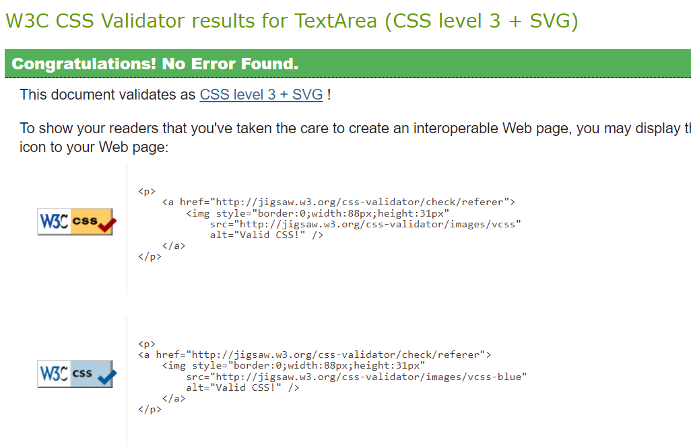
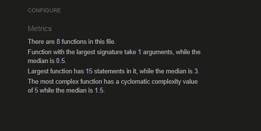
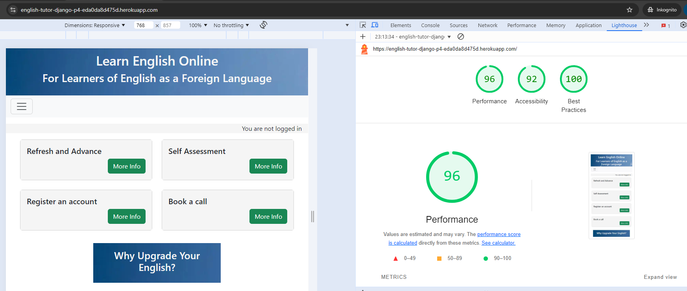
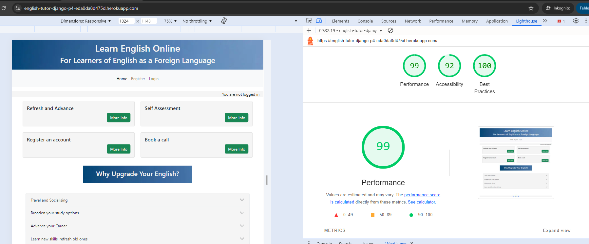

# Project 4 English Tutor: Testing Overview 

I have separated the testing out of my ReadMe, as that document was already quite long.

## HTML:

No errors:  **UPDATE WITH HEROKU LINK**
https://validator.w3.org/nu/?showsource=yes&doc=https%3A%2F%2F8000-richprich-englishtutord-94zz8l90n00.ws.codeinstitute-ide.net%2F#l167c8

## CSS
- No Errors
- Method of testing: direct input

## Javascript
My JS passes throws no errors in JSHint: https://jshint.com/

I added the following comments to JSHint so it recognised which version to use, and that I was using Bootstrap in my project: 

- /* jshint esversion: 6 */
- /* global bootstrap */

## Python

Note: I did not check auto-generated files such as migrations and ___init__.py.  

|Test file                                          | Outcome	                |  Comments              
| ---------------------------------------------	| ---------------------------------	| -------------------	  	
|Appointments - admin.py                    |  Clear      | -    |  
|Appointments - apps.py                    |   Clear      | -    |  
|Appointments - forms.py                   |  Clear      | -    |  
|Appointments - models.py                   | Clear      | -    |   
|Appointments - urls.py                   | Clear      | -    |   
|Appointments - views.py                   | Clear      | -    |  
|English_tutor - settings.py                   | Clear       | Blank and trailing spaces corrected; otherwise I followed Joanna Gorska's advice here https://www.youtube.com/watch?t=1648&v=6j9dZTW4owI&feature=youtu.be and added # noqa as appropriate -    |   
|English_tutor - urls.py                   | Clear      | -    |   
|English_tutor - views.py                   | Clear      | -    |   
|Games_and_exercises - admin.py                    | Clear       | -    |  
|Games_and_exercises - forms.py                   |   Clear     | -    |  
|Games_and_exercises - models.py                   | Clear       | -    |   
|Games_and_exercises - urls.py                   |  Clear     | -    |   
|Games_and_exercises - views.py                   |   Clear    | -    |   
|Home - urls.py                     |  Clear     | -    |   
|Home - views.py                   |   Clear    | -    | 
|user_accounts - admin.py                     |  Clear     | -    |   
|user_accounts - models.py                     |  Clear     | -    |   
|user_accounts - urls.py                     |  Clear      | -    |   
|user_accounts - views.py                   |    Clear    | -    | 

## Lighthouse 

The site performs well on Lighthouse.

Testing method: open an incognito tab -> open project link -> open DevToops -> run Lighthouse check.  

- Mobile

- Desktop

## Site functionality testing

**Test 1: User: not signed in**
|Test                                           | Expected outcome	                |  Result             | Passed all Browsers?
| ---------------------------------------------	| ---------------------------------	| -------------------	 | -------------------	 	
|Hompage - navbar links                  | Only home, register and log-in are visible         | Pass   |  yes
|Hompage - navbar links                  | Accessible via burger icon for mobile & tablet         | Pass   |  yes
|Navbar - home - click logo                     | Refresh page             	        | Pass    	      	| yes
|Navbar - click burger bar (mobile only)        | Opens navigation         	        | Pass    | yes
|Hompage - click Home button                    | Refresh page             	        | Pass  | yes
|Hompage - click Register button                | Opens registration page               | Pass  | yes
|Hompage - Registration page                    | All fields can be filled-in              | Pass  | yes
|Hompage - Registration page                    | All fields mandatory  apart from email             | Pass  | yes
|Hompage - Registration page                    | Unsucessful registration: reasons are clear             | Pass  | yes
|Hompage - Registration page                    | Successful regisration leads to sign-in & full functionality             | Pass  | yes
|Hompage - Registration page                    | Successful registration: user welcomed by name on top-right of page             | Pass  | yes
|Hompage - click Sign-in button                 | Opens sign-in page          | Pass   | yes
|Hompage - click Sign-in button                 | Fields can be filled in          | Pass   | yes 
|Hompage - click Sign-in button                 | Successful sign-in leads to full functionality         | Pass   | yes 
|Hompage - Registration page                    | Successful registration: user welcomed by name on top-right of page             | Pass  | yes
|Hompage - card elements                        | Can be opened and closed individually         | Pass   | yes 
|Hompage - card elements: registration link     | Leads to registration page         | Pass   | yes 
|Hompage - card elements: book a call  link     | Opens sign-in Modal         | Pass   | yes 
|Hompage - card elements: book a call - Modal   | Links to sign-in and registration work        | Pass   | yes 
|Hompage - accordion elements                   | Can be opened and closed individually          | Pass   | yes 

**Test 2: User signed in: homepage**

**Test 3: User signed in: appointments - making and managing**

**Test 4: User signed in: games and exercises**

|Footer - links are clickable and lead to correct destinations  | Open Facebook, Instagram, YouTube        | Pass   | yes 
