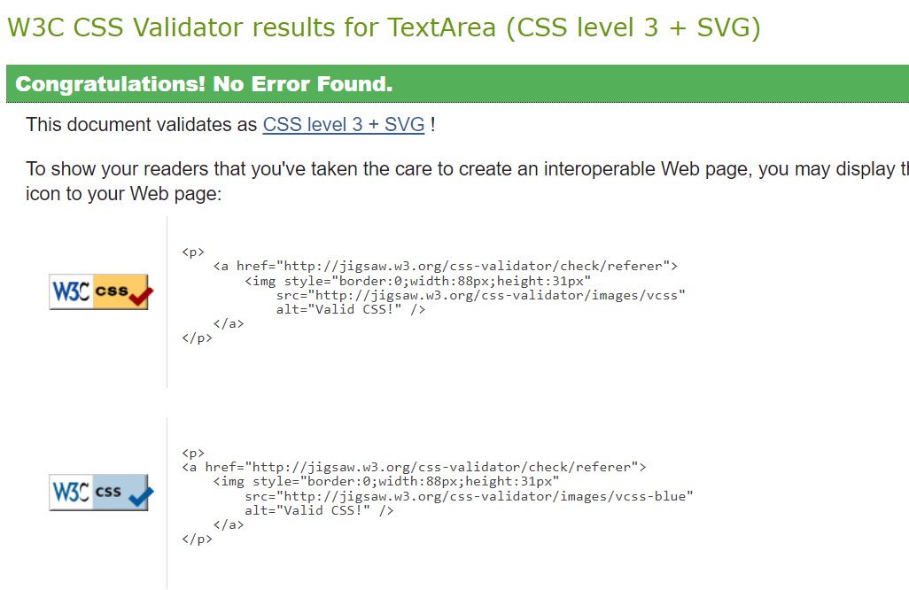
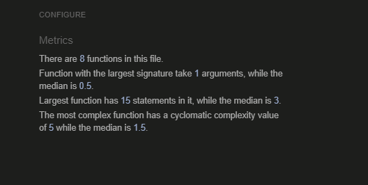
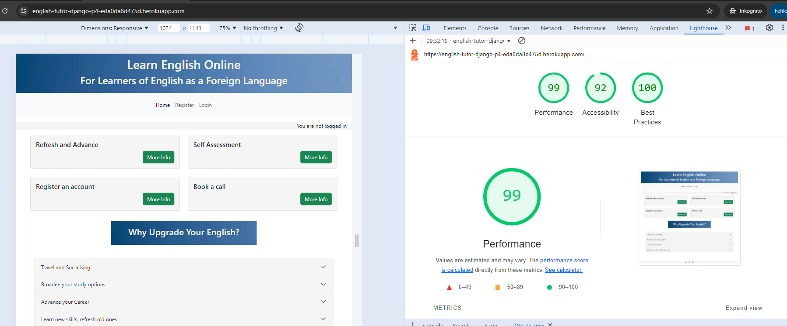

# Project 4 English Tutor: Test Results and Overview 

This document details the testing I have done for my Project 4. I have separated the testing out of my ReadMe, as that document was already quite long.

Unfortunately I was unable to implement automated testing properly, so all testing was done manually. This is something I would like to work on however, and have ready for my P5.  

## HTML:

No errors:  **UPDATE WITH HEROKU LINK**
https://validator.w3.org/nu/?showsource=yes&doc=https%3A%2F%2F8000-richprich-englishtutord-94zz8l90n00.ws.codeinstitute-ide.net%2F#l167c8

## CSS
- Resource used: https://jigsaw.w3.org/css-validator/
- No Errors
- Method of testing: direct input

## Javascript
- Resource used: JSHint: https://jshint.com/
- My JS passes throws no errors

I added the following comments to JSHint so it recognised which version to use, and that I was using Bootstrap in my project: 

- /* jshint esversion: 6 */
- /* global bootstrap */

## Python

Note: I did not check auto-generated files such as migrations and ___init__.py.  

|Test file                                          | Outcome	                |  Comments              
| ---------------------------------------------	| ---------------------------------	| -------------------	  	
|Appointments - admin.py                    |  Clear      | -    |  
|Appointments - apps.py                    |   Clear      | -    |  
|Appointments - forms.py                   |  Clear      | -    |  
|Appointments - models.py                   | Clear      | -    |   
|Appointments - urls.py                   | Clear      | -    |   
|Appointments - views.py                   | Clear      | -    |  
|English_tutor - settings.py                   | Clear       | Blank and trailing spaces corrected; otherwise I followed Joanna Gorska's advice here https://www.youtube.com/watch?t=1648&v=6j9dZTW4owI&feature=youtu.be and added # noqa as appropriate -    |   
|English_tutor - urls.py                   | Clear      | -    |   
|English_tutor - views.py                   | Clear      | -    |   
|Games_and_exercises - admin.py                    | Clear       | -    |  
|Games_and_exercises - forms.py                   |   Clear     | -    |  
|Games_and_exercises - models.py                   | Clear       | -    |   
|Games_and_exercises - urls.py                   |  Clear     | -    |   
|Games_and_exercises - views.py                   |   Clear    | -    |   
|Home - urls.py                     |  Clear     | -    |   
|Home - views.py                   |   Clear    | -    | 
|user_accounts - admin.py                     |  Clear     | -    |   
|user_accounts - models.py                     |  Clear     | -    |   
|user_accounts - urls.py                     |  Clear      | -    |   
|user_accounts - views.py                   |    Clear    | -    | 

## Lighthouse 

The site performs well on Lighthouse.

Testing method: open an incognito tab -> open project link -> open DevToops -> run Lighthouse check.  

- Mobile

- Desktop

## Site functionality testing

**Test 1. User not signed in: homepage**
|Test                                           | Expected outcome	                |  Result             | Passed all Browsers?
| ---------------------------------------------	| ---------------------------------	| -------------------	 | -------------------	 	
|Hompage - navbar links                  | Only home, register and log-in are visible         | Pass   |  yes
|Hompage - navbar links                  | Accessible via burger icon for mobile & tablet         | Pass   |  yes
|Navbar - home - click logo                     | Refresh page             	        | Pass    	      	| yes
|Navbar - click burger bar (mobile only)        | Opens navigation         	        | Pass    | yes
|Hompage - click Home button                    | Refresh page             	        | Pass  | yes
|Hompage - click Register button                | Opens registration page               | Pass  | yes
|Hompage - Registration page                    | All fields can be filled-in              | Pass  | yes
|Hompage - Registration page                    | All fields mandatory  apart from email             | Pass  | yes
|Hompage - Registration page                    | Unsucessful registration: reasons are clear             | Pass  | yes
|Hompage - Registration page                    | Successful regisration leads to sign-in & full functionality             | Pass  | yes
|Hompage - Registration page                    | Successful registration: user welcomed by name on top-right of page             | Pass  | yes
|Hompage - click Sign-in button                 | Opens sign-in page          | Pass   | yes
|Hompage - click Sign-in button                 | Fields can be filled in          | Pass   | yes 
|Hompage - click Sign-in button                 | Successful sign-in leads to full functionality         | Pass   | yes 
|Hompage - Registration page                    | Successful registration: user welcomed by name on top-right of page             | Pass  | yes
|Hompage - card elements                        | Can be opened and closed individually         | Pass   | yes 
|Hompage - card elements: registration link     | Leads to registration page         | Pass   | yes 
|Hompage - card elements: book a call  link     | Opens sign-in Modal         | Pass   | yes 
|Hompage - card elements: book a call - Modal   | Links to sign-in and registration work        | Pass   | yes 
|Hompage - accordion elements                   | Can be opened and closed individually          | Pass   | yes 
|Footer - links are clickable and lead to correct destinations  | Open Facebook, Instagram, YouTube        | Pass   | yes 

**Test 2. User signed in: homepage**
|Test                                           | Expected outcome	                |  Result             | Passed all Browsers?
| ---------------------------------------------	| ---------------------------------	| -------------------	 | -------------------
|Hompage - navbar links                  | All navbar options are visible         | Pass   |  yes
|Hompage - navbar links                  | Accessible via burger icon for mobile & tablet         | Pass   |  yes
|Navbar - home - click logo                     | Refresh page             	        | Pass    	      	| yes
|Navbar - click burger bar (mobile only)        | Opens navigation         	        | Pass    | yes
|Hompage - click Home button                    | Refresh page             	        | Pass  | yes
|Hompage - click Register button                | Not visible or accessible              | Pass  | yes
|Hompage - click Sign-in button                 | Not visible or accessible          | Pass   | yes
|Hompage - Sign-out button                 | visible         | Pass   | yes 
|Hompage - click Sign-in button                 | Successful sign-in leads to full functionality         | Pass   | yes 
|Hompage - Registration page                    | Successful registration: user welcomed by name on top-right of page             | Pass  | yes
|Hompage - card elements                        | Can be opened and closed individually         | Pass   | yes 
|Hompage - card elements: registration link     | Leads to registration page         | Pass   | yes 
|Hompage - card elements: book a call  link     | Opens sign-in Modal         | Pass   | yes 
|Hompage - card elements: book a call - Modal   | Links to sign-in and registration work        | Pass   | yes 
|Hompage - accordion elements                   | Can be opened and closed individually          | Pass   | yes 

**Test 3. User signed in: appointments - making, changing and cancelling**
|Test                                           | Expected outcome	                |  Result             | Passed all Browsers?
| ---------------------------------------------	| ---------------------------------	| -------------------	 | -------------------
|Book appointment - navbar links                  | All navbar options are visible         | Pass   |  yes
|Book appointment - appt form                  | Accessible via burger icon for mobile & tablet         | Pass   |  yes
|Book appointment - click link                   | opens book appointment page            	        | Pass    	      	| yes
|Book appointment - meeting date                     | can choose date             	        | Pass    	      	| yes
|Book appointment - meeting time        | can choose time         	        | Pass    | yes
|Book appointment - add optional message                    | can add message             	        | Pass  | yes
|Book appointment - empty optional message                    | can book appt without message             	        | Pass  | yes
|Book appointment - validation: date                    | can't choose a time in the past             	        | Pass  | yes
|Book appointment - validation: date                    | can't choose a time more than 4 weeks in the future             	        | Pass  | yes
|Book appointment - validation: date error messages                    | error messages show            	        | Pass  | yes
|Book appointment - validation: morning time                    | appts available 08:00 - 12:30 only            	        | Pass  | yes
|Book appointment - validation: afternoon time                    | appts available 14:00 - 18:00 only            	        | Pass  | yes
|Book appointment - validation: meeting clash                    | can't schedule 2 appointments at the same time           	        | Pass  | yes
|Book appointment - success                   | confirmation page is shown with appt details          	        | Pass  | yes
|Book appointment - confirmation page                   | links to manage appts and homepage are shown and work          	        | Pass  | yes
|Manage your appointment(s): click link                    | if there are no appointments, 'no appointments' message is shown        	        | Pass  | yes
|Manage your appointment(s): overview               | if there are appointments, they are listed          	        | Pass  | yes
|Manage your appointment(s): overview                    | if there are appointments, they are listed with edit and cancel options         	        | Pass  | yes
|Manage your appointment(s): overview               | if there are appointments, they are listed          	        | Pass  | yes
|Manage your appointment(s): click edit               | it is possible to change date, time, date and time    	        | Pass  | yes
|Manage your appointment(s): click edit               | same validation is applied as 'book appointments'  	        | Pass  | yes
|Manage your appointment(s): click edit               | can save new appointment  	        | Pass  | yes
|Manage your appointment(s): click edit               | confirmation is shown  	        | Pass  | yes
|Manage your appointment(s): click cancel               | triggers confirmation modal  	        | Pass  | yes
|Manage your appointment(s): click cancel               | modal allows for user to keep original appt   	        | Pass  | yes
|Manage your appointment(s): click cancel               | modal allows user to cancel appointment   	        | Pass  | yes
|Manage your appointment(s): click cancel               | cancellation is shown   	        | Pass  | yes

**Test 4: User signed in: games and exercises**
|Test                                           | Expected outcome	                |  Result             | Passed all Browsers?
| ---------------------------------------------	| ---------------------------------	| -------------------	 | -------------------
|Games and Exercises - click navbar link                  | triggers dropdown menue         | Pass   |  yes
|Games and Exercises - navbar language section            | each language section A2 - C1 is clickable and leads to the relevant section | Pass   |  yes
|Games and Exercises - click language section A2 - C1           | opens the section page displaying exercise topics         | Pass    	      	| yes
|Games and Exercises - click the language topic           | reveals the exercises        | Pass    	      	| yes
|Games and Exercises - click submit for answers                    | get feedback on correct, incorrect, reminder to add an answer  | Pass    	      	| yes

**Test 5: Admin section**

**Note: I have only tested this on Chrome.**

|Test                                           | Expected outcome	                |  Result             | Passed all Browsers?
| ---------------------------------------------	| ---------------------------------	| -------------------	 | -------------------
|Admin availability                   | can only be accessed with superuser creds         | Pass   |  yes
|Admin - email addresses           | can be deleted | Pass   |  yes
|Admin - email addresses: click on one           | displays user details | Pass   |  yes
|Admin - email addresses: click on one           | is linked to a specific user number | Pass   |  yes
|Admin - email addresses: click on one           | not possible to change the user number to one assigned to a different user | Pass   |  yes
|Admin - email addresses: click on one           | can click through to the specific user | Pass   |  yes
|Admin - appointments           | displays all appointments | Pass   |  yes
|Admin - appointments           | can delete an appointments | Pass   |  yes
|Admin - appointments           | can make a new appointment | Pass   |  yes
|Admin - authentication and authorisation - groups           | not currently in use | n/a   |  n/a 
|Admin - authentication and authorisation - users           | can add a user | pass   |  yes
|Admin - authentication and authorisation - personal info           | can first name, last name, new email | pass   |  yes
|Admin - django summernote           | not currently in use | n/a   |  n/a 
|Admin - games and exercises           | can add a quiz question | pass   |  yes
|Admin - games and exercises           | can edit a quiz question | pass   |  yes
|Admin - games and exercises           | can delete a quiz question | pass   |  yes
|Admin - games and exercises           | can link a quiz question to a section | pass   |  yes
|Admin - games and exercises           | can add a section | pass   |  yes
|Admin - games and exercises           | can edit a section | pass   |  yes
|Admin - games and exercises           | can delete a section | pass   |  yes
|Admin - No other sections are currently in use.          | n/a | n/a   |  n/a

# END OF DOCUMENT